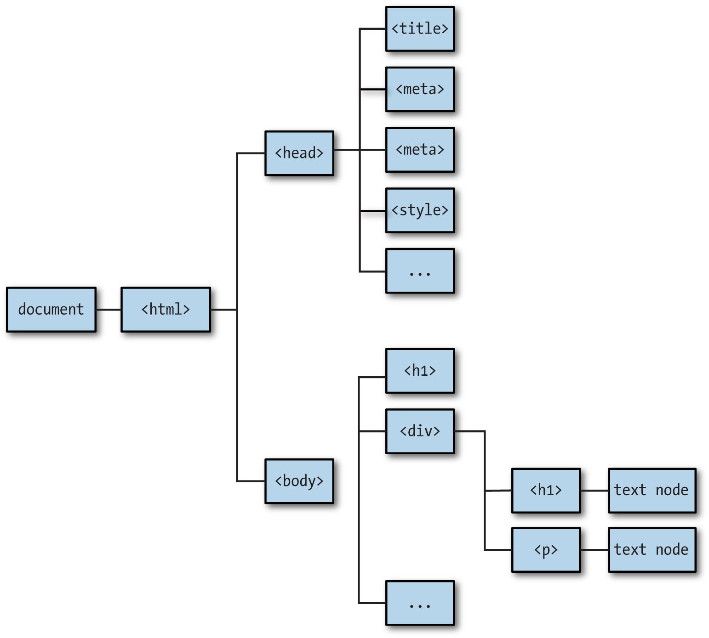
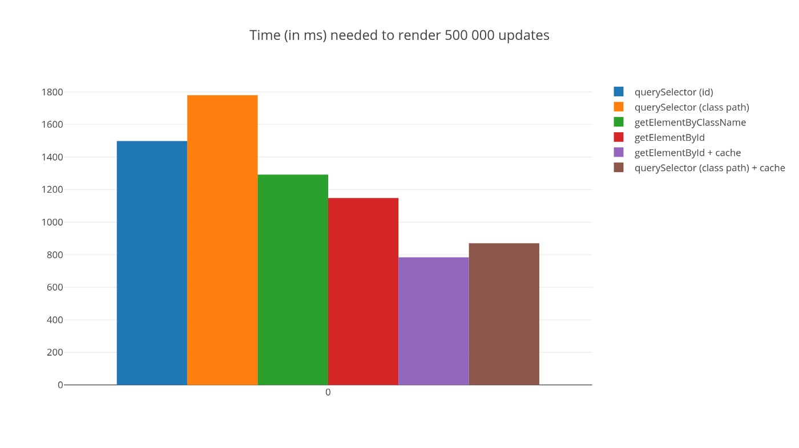

# # JavaScript Session-8 Class Notes :rocket:

## Session-8 DOM(Document Object Model)

The Document Object Model (DOM) is the data representation of the objects that comprise the structure and content of a document on the web

The Document Object Model (DOM) is a programming interface for web documents. It represents the page so that programs can change the document structure, style, and content. The DOM represents the document as nodes and objects; that way, programming languages can interact with the page.

A web page is a document that can be either displayed in the browser window or as the HTML source. In both cases, it is the same document but the Document Object Model (DOM) representation allows it to be manipulated. As an object-oriented representation of the web page, it can be modified with a scripting language such as JavaScript.

### Document Object and Window Interface 
- The Window interface(web page) represents a window containing a DOM document.
- The (window)document property points to the DOM document loaded in that window.
- The Window interface is home to a variety of functions, namespaces, objects, and constructors

The document and window objects are the objects whose interfaces you generally use most often in DOM programming. In simple terms, the window object represents something like the browser, and the document object is the root of the document itself. Element inherits from the generic Node interface, and together these two interfaces provide many of the methods and properties you use on individual elements. These elements may also have specific interfaces for dealing with the kind of data those elements hold, as in the table object example in the previous section.

## DOM Access Methods

- document.getElementById(selector)
- document.getElementsByClassName(selector)
- document.getElementsByName(selector)
- document.getElementsByTagName(selector)
- document.querySelector(selector)
- document.querySelectorAll(selector)

## DOM Access Methods Performances

## DOM Methods

- document.createElement(tagName)
- parentNode.appendChild(node)
- element.innerHTML
- element.innerText
- element.textContent
- element.value (input)
- element.setAttribute("key", "value")
- element.getAttribute("value")

## DOM Styling

- element.style....
- element.className = "className"
- element.classList.add("className")
- element.classList.remove("className")

## Summary
An HTML/XML document is represented inside the browser as the DOM tree.

Tags become element nodes and form the structure.
Text becomes text nodes.
…etc, everything in HTML has its place in DOM, even comments.
We can use developer tools to inspect DOM and modify it manually.

Here we covered the basics, the most used and important actions to start with. There’s an extensive documentation about Chrome Developer Tools at https://developers.google.com/web/tools/chrome-devtools. The best way to learn the tools is to click here and there, read menus: most options are obvious. Later, when you know them in general, read the docs and pick up the rest.

DOM nodes have properties and methods that allow us to travel between them, modify them, move around the page, and more. We’ll get down to them in the next chapters.

## References

1. https://developer.mozilla.org/en-US/docs/Web/API/Document_Object_Model/Introduction
2. https://javascript.info/dom-nodes
3. https://www.dynamicwebtraining.com.au/blog/javascript-dom-methods

